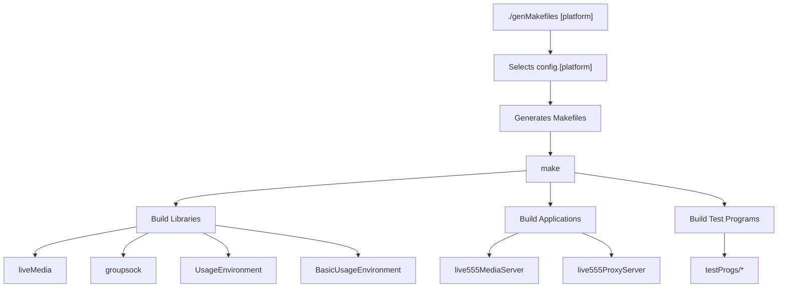
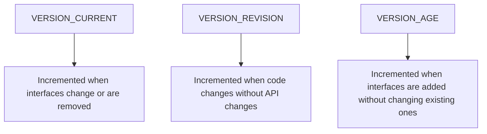
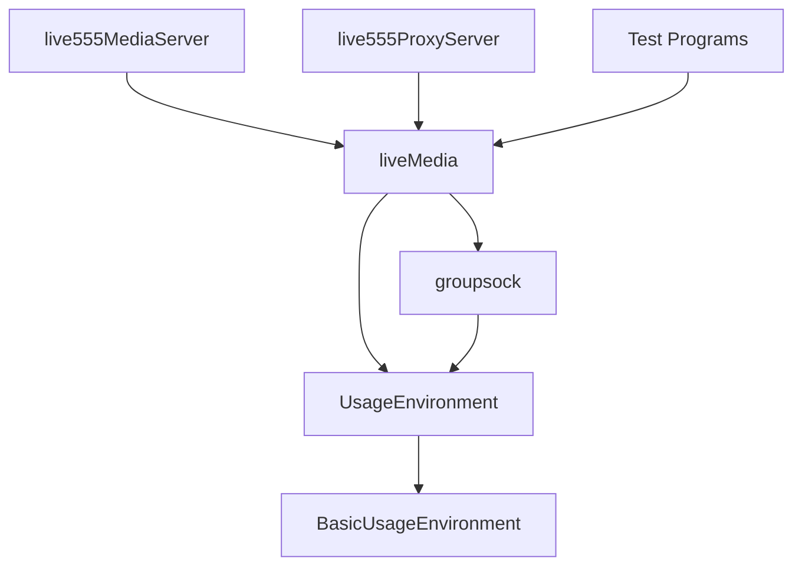
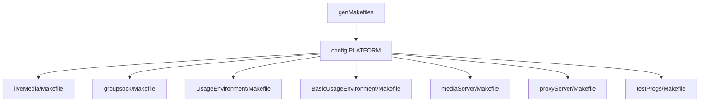

# Build System

> **Relevant source files**
> * [README.md](https://github.com/rgaufman/live555/blob/a0eb8f91/README.md)
> * [config.linux](https://github.com/rgaufman/live555/blob/a0eb8f91/config.linux)
> * [config.linux-with-shared-libraries](https://github.com/rgaufman/live555/blob/a0eb8f91/config.linux-with-shared-libraries)
> * [modifications.patch](https://github.com/rgaufman/live555/blob/a0eb8f91/modifications.patch)

The LIVE555 build system provides a portable, make-based framework for compiling the media streaming libraries and applications across different platforms. This document describes the build process, configuration options, and outputs.

## Build Process Overview

Building the LIVE555 libraries and applications involves two primary steps:

1. Generate platform-specific Makefiles using the `genMakefiles` script
2. Use the standard `make` utility to compile the code

### Build Flow



Sources: [README.md L3-L6](https://github.com/rgaufman/live555/blob/a0eb8f91/README.md#L3-L6)

## Platform Configurations

The build system includes configuration files for various operating systems and environments. Each platform-specific configuration file defines compiler settings, flags, and build options.

### Supported Platforms

The repository includes configuration files for many platforms, including:

| Platform | Configuration File |
| --- | --- |
| Linux | config.linux |
| Linux (shared libraries) | config.linux-with-shared-libraries |
| macOS | config.macosx |
| Cygwin | config.cygwin |
| FreeBSD | config.freebsd |
| iOS | config.iphoneos |
| OpenBSD | config.openbsd |
| Solaris (64-bit) | config.solaris-64bit |

Sources: [README.md L8](https://github.com/rgaufman/live555/blob/a0eb8f91/README.md#L8-L8)

### Configuration Structure

Each platform configuration file defines key variables that control the build process. Here's an example from the Linux configuration:

```
COMPILE_OPTS =    $(INCLUDES) -I/usr/local/include -I. -O2 -DSOCKLEN_T=socklen_t -D_LARGEFILE_SOURCE=1 -D_FILE_OFFSET_BITS=64 -DALLOW_RTSP_SERVER_PORT_REUSE=1
C_COMPILER =      cc
CPLUSPLUS_COMPILER = c++
LINK =            c++ -o
LIBRARY_LINK =    ar cr
LIB_SUFFIX =      a
```

Sources: [config.linux L1-L16](https://github.com/rgaufman/live555/blob/a0eb8f91/config.linux#L1-L16)

## Library Versioning

For shared library builds using `config.linux-with-shared-libraries`, the system uses a versioning scheme based on GNU libtool conventions:



The shared library suffix is calculated using this formula:

```
LIB_SUFFIX = so.$(shell expr $(VERSION_CURRENT) - $(VERSION_AGE)).$(VERSION_AGE).$(VERSION_REVISION)
```

For example, with current settings in the repository:

| Library | VERSION_CURRENT | VERSION_REVISION | VERSION_AGE | Result |
| --- | --- | --- | --- | --- |
| liveMedia | 115 | 4 | 0 | so.115.0.4 |
| BasicUsageEnvironment | 3 | 0 | 1 | so.2.1.0 |
| UsageEnvironment | 5 | 0 | 2 | so.3.2.0 |
| groupsock | 32 | 0 | 2 | so.30.2.0 |

Sources: [config.linux-with-shared-libraries L1-L24](https://github.com/rgaufman/live555/blob/a0eb8f91/config.linux-with-shared-libraries#L1-L24)

## Library Dependencies

The LIVE555 libraries have the following dependency structure:



## Common Build Options

The configuration files include several important compile-time options:

| Option | Description |
| --- | --- |
| `-DALLOW_RTSP_SERVER_PORT_REUSE=1` | Enables port reuse for RTSP servers |
| `-D_LARGEFILE_SOURCE=1` | Enables large file support |
| `-D_FILE_OFFSET_BITS=64` | Sets 64-bit file offsets |
| `-fPIC` | Position-independent code for shared libraries |
| `-DSOCKLEN_T=socklen_t` | Defines socket length type |

Sources: [config.linux L1-L4](https://github.com/rgaufman/live555/blob/a0eb8f91/config.linux#L1-L4)

 [config.linux-with-shared-libraries L27](https://github.com/rgaufman/live555/blob/a0eb8f91/config.linux-with-shared-libraries#L27-L27)

 [modifications.patch L34-L37](https://github.com/rgaufman/live555/blob/a0eb8f91/modifications.patch#L34-L37)

## Build Outputs

The build system produces the following outputs:

### Libraries

1. **liveMedia** - Core media processing library * Implements media formats, RTP payloading, RTSP protocol
2. **groupsock** - Socket and networking library * Handles UDP/TCP sockets, multicast groups
3. **UsageEnvironment** - Environment interface * Abstract interface for task scheduling and logging
4. **BasicUsageEnvironment** - Basic environment implementation * Concrete implementation of UsageEnvironment

### Applications

1. **live555MediaServer** - RTSP server for media files * Location: `./mediaServer/live555MediaServer`
2. **live555ProxyServer** - RTSP proxy server * Location: `./proxyServer/live555ProxyServer`

### Test Programs

Various test programs located in `./testProgs/`:

* `testRTSPClient` - Test client for RTSP streams
* `testOnDemandRTSPServer` - Test RTSP server
* Media-specific test applications for different formats

Sources: [README.md L10-L14](https://github.com/rgaufman/live555/blob/a0eb8f91/README.md#L10-L14)

## Building LIVE555

### Basic Build Process

To build the libraries and applications:

1. Generate platform-specific Makefiles: ``` ./genMakefiles linux ``` (Replace "linux" with your platform)
2. Compile the code: ``` make -j4 ```

Sources: [README.md L3-L6](https://github.com/rgaufman/live555/blob/a0eb8f91/README.md#L3-L6)

### Build Configuration Customizations

The repository includes some customizations to the standard LIVE555 build:

1. **Increased buffer sizes** - The default `OutPacketBuffer::maxSize` has been increased to 2,000,000 bytes to better handle large video frames from IP cameras.
2. **RTSP server port reuse** - Added `-DALLOW_RTSP_SERVER_PORT_REUSE=1` to force reusing existing ports when restarting servers.

Sources: [README.md L18-L22](https://github.com/rgaufman/live555/blob/a0eb8f91/README.md#L18-L22)

 [modifications.patch L34-L37](https://github.com/rgaufman/live555/blob/a0eb8f91/modifications.patch#L34-L37)

 [modifications.patch L41-L48](https://github.com/rgaufman/live555/blob/a0eb8f91/modifications.patch#L41-L48)

## Makefile Generation

The `genMakefiles` script selects the appropriate platform configuration file and generates Makefiles in each directory:



The generated Makefiles contain the appropriate compiler flags, include paths, and library dependencies for building on the target platform.