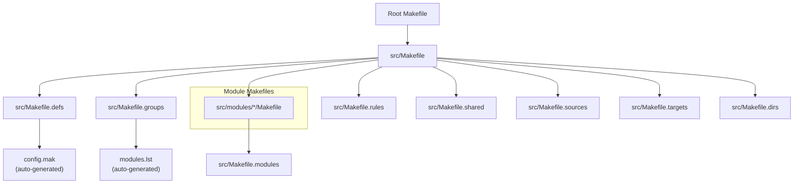
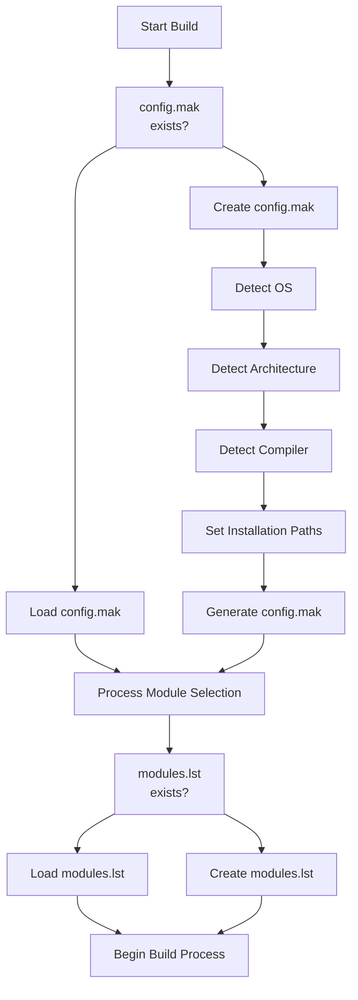
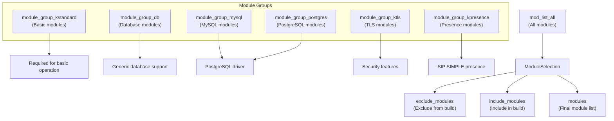
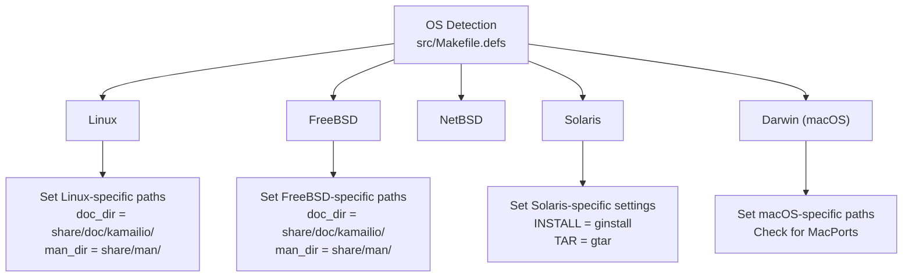
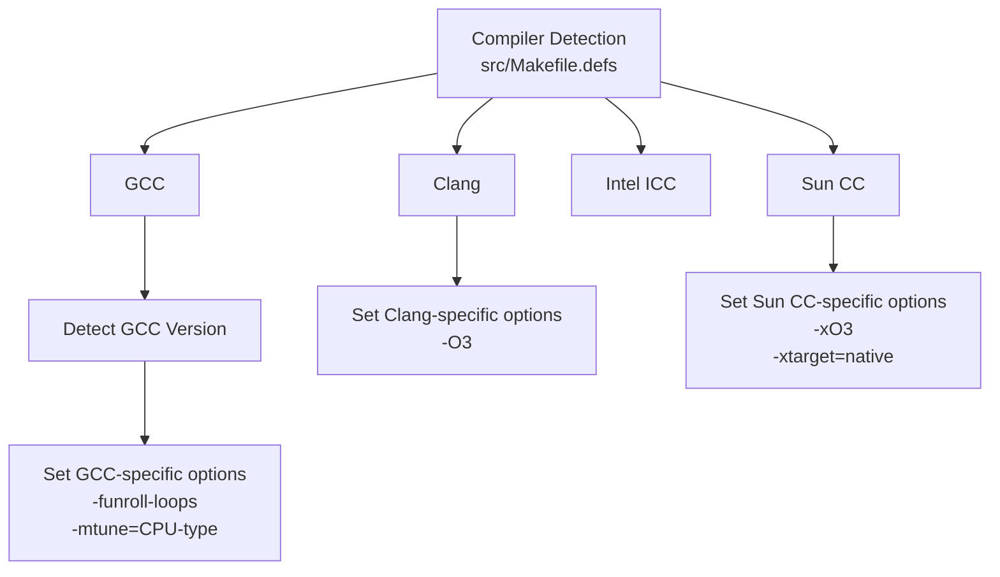
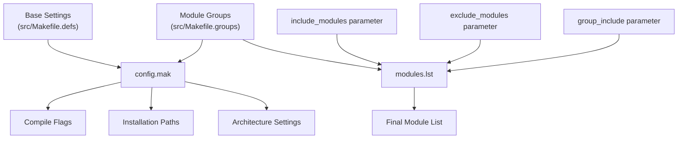

# Build Configuration

> **Relevant source files**
> * [CMakeLists.txt](https://github.com/kamailio/kamailio/blob/2b4e9f8b/CMakeLists.txt)
> * [Makefile](https://github.com/kamailio/kamailio/blob/2b4e9f8b/Makefile)
> * [cmake/cmake-uninstall.cmake.in](https://github.com/kamailio/kamailio/blob/2b4e9f8b/cmake/cmake-uninstall.cmake.in)
> * [src/Makefile](https://github.com/kamailio/kamailio/blob/2b4e9f8b/src/Makefile)
> * [src/Makefile.defs](https://github.com/kamailio/kamailio/blob/2b4e9f8b/src/Makefile.defs)
> * [src/Makefile.groups](https://github.com/kamailio/kamailio/blob/2b4e9f8b/src/Makefile.groups)
> * [src/Makefile.modules](https://github.com/kamailio/kamailio/blob/2b4e9f8b/src/Makefile.modules)
> * [src/Makefile.shared](https://github.com/kamailio/kamailio/blob/2b4e9f8b/src/Makefile.shared)
> * [src/Makefile.targets](https://github.com/kamailio/kamailio/blob/2b4e9f8b/src/Makefile.targets)
> * [src/Makefile.utils](https://github.com/kamailio/kamailio/blob/2b4e9f8b/src/Makefile.utils)
> * [src/modules/auth_radius/Makefile](https://github.com/kamailio/kamailio/blob/2b4e9f8b/src/modules/auth_radius/Makefile)
> * [src/modules/auth_radius/cfg/dictionary.kamailio](https://github.com/kamailio/kamailio/blob/2b4e9f8b/src/modules/auth_radius/cfg/dictionary.kamailio)
> * [src/modules/auth_radius/cfg/dictionary.sip-router](https://github.com/kamailio/kamailio/blob/2b4e9f8b/src/modules/auth_radius/cfg/dictionary.sip-router)
> * [src/modules/topos_htable/Makefile](https://github.com/kamailio/kamailio/blob/2b4e9f8b/src/modules/topos_htable/Makefile)
> * [src/modules/topos_htable/doc/Makefile](https://github.com/kamailio/kamailio/blob/2b4e9f8b/src/modules/topos_htable/doc/Makefile)
> * [src/modules/topos_htable/doc/topos_htable.xml](https://github.com/kamailio/kamailio/blob/2b4e9f8b/src/modules/topos_htable/doc/topos_htable.xml)
> * [src/modules/topos_htable/doc/topos_htable_admin.xml](https://github.com/kamailio/kamailio/blob/2b4e9f8b/src/modules/topos_htable/doc/topos_htable_admin.xml)
> * [src/modules/topos_htable/topos_htable_mod.c](https://github.com/kamailio/kamailio/blob/2b4e9f8b/src/modules/topos_htable/topos_htable_mod.c)
> * [src/modules/topos_htable/topos_htable_storage.c](https://github.com/kamailio/kamailio/blob/2b4e9f8b/src/modules/topos_htable/topos_htable_storage.c)
> * [src/modules/topos_htable/topos_htable_storage.h](https://github.com/kamailio/kamailio/blob/2b4e9f8b/src/modules/topos_htable/topos_htable_storage.h)

This document describes the build configuration system for Kamailio SIP Server. It explains how to configure the Kamailio build process, including compiler options, module selection, platform-specific settings, and installation paths. For information about module compilation specifically, see [Module Compilation System](/kamailio/kamailio/5.2-module-compilation-system).

## 1. Build System Overview

Kamailio's build system is primarily based on GNU Make with a collection of interlocking Makefiles. The system also has initial support for CMake as an alternative build method.

### 1.1 Build System Architecture



Sources: [Makefile](https://github.com/kamailio/kamailio/blob/2b4e9f8b/Makefile)

 [src/Makefile L94-L102](https://github.com/kamailio/kamailio/blob/2b4e9f8b/src/Makefile#L94-L102)

 [src/Makefile.defs](https://github.com/kamailio/kamailio/blob/2b4e9f8b/src/Makefile.defs)

 [src/Makefile.groups](https://github.com/kamailio/kamailio/blob/2b4e9f8b/src/Makefile.groups)

### 1.2 Key Build Files

| Filename | Purpose |
| --- | --- |
| Makefile | Root Makefile that forwards commands to src/ |
| src/Makefile | Main Makefile coordinating the build process |
| src/Makefile.defs | Defines compiler flags, architecture detection, OS detection |
| src/Makefile.groups | Defines module groups and their dependencies |
| src/Makefile.modules | Template for module Makefiles |
| src/Makefile.targets | Defines all available build targets |
| config.mak | Auto-generated file with saved build configuration |
| modules.lst | Auto-generated file with modules configuration |

Sources: [Makefile](https://github.com/kamailio/kamailio/blob/2b4e9f8b/Makefile)

 [src/Makefile](https://github.com/kamailio/kamailio/blob/2b4e9f8b/src/Makefile)

 [src/Makefile.defs](https://github.com/kamailio/kamailio/blob/2b4e9f8b/src/Makefile.defs)

 [src/Makefile.groups](https://github.com/kamailio/kamailio/blob/2b4e9f8b/src/Makefile.groups)

## 2. Build Configuration Methods

### 2.1 Configuration Workflow



Sources: [src/Makefile L93-L137](https://github.com/kamailio/kamailio/blob/2b4e9f8b/src/Makefile#L93-L137)

 [src/Makefile L311-L339](https://github.com/kamailio/kamailio/blob/2b4e9f8b/src/Makefile#L311-L339)

### 2.2 Configuration Commands

There are several approaches to configuring the Kamailio build:

1. **Using `make cfg` or `make config`**: Generates or updates config.mak and modules.lst
2. **Using environment variables**: Set options before running make
3. **Using command-line parameters**: Pass options directly to make

```markdown
# Example: Configure with command-line parameters
make prefix=/usr include_modules="dialog tls" exclude_modules="auth_diameter" cfg
```

Sources: [src/Makefile L342-L346](https://github.com/kamailio/kamailio/blob/2b4e9f8b/src/Makefile#L342-L346)

## 3. Key Configuration Variables

### 3.1 Module Selection Variables

| Variable | Description |
| --- | --- |
| exclude_modules | Modules to exclude from compilation |
| include_modules | Modules to include in compilation (overrides exclude) |
| static_modules | Modules to compile statically into main binary |
| group_include | Groups of modules to include (e.g., "mysql postgres db") |

Sources: [src/Makefile L61-L82](https://github.com/kamailio/kamailio/blob/2b4e9f8b/src/Makefile#L61-L82)

 [src/Makefile.defs L10-L11](https://github.com/kamailio/kamailio/blob/2b4e9f8b/src/Makefile.defs#L10-L11)

### 3.2 Compiler and Flags

| Variable | Description |
| --- | --- |
| CC | C compiler command (defaults to gcc) |
| CFLAGS | C compiler flags |
| CC_EXTRA_OPTS | Extra compiler options |
| LD_EXTRA_OPTS | Extra linker options |
| mode | Build mode: "debug" or "release" |

Sources: [src/Makefile.defs L177-L180](https://github.com/kamailio/kamailio/blob/2b4e9f8b/src/Makefile.defs#L177-L180)

 [src/Makefile.defs L792-L796](https://github.com/kamailio/kamailio/blob/2b4e9f8b/src/Makefile.defs#L792-L796)

### 3.3 Installation Paths

| Variable | Description |
| --- | --- |
| PREFIX | Base installation directory (default: /usr/local) |
| LIBDIR | Library directory (default: lib or lib64 based on architecture) |
| DESTDIR | Destination for staged installation |
| CFG_NAME | Config file name (default: kamailio) |

Sources: [src/Makefile.defs L483-L498](https://github.com/kamailio/kamailio/blob/2b4e9f8b/src/Makefile.defs#L483-L498)

 [src/Makefile.defs L545-L562](https://github.com/kamailio/kamailio/blob/2b4e9f8b/src/Makefile.defs#L545-L562)

## 4. Module Selection and Grouping

Kamailio organizes modules into functional groups for easier configuration. These groups are defined in `src/Makefile.groups`.

### 4.1 Module Groups Architecture



Sources: [src/Makefile.groups L294-L345](https://github.com/kamailio/kamailio/blob/2b4e9f8b/src/Makefile.groups#L294-L345)

### 4.2 Common Module Groups

| Group Name | Description | Use Case |
| --- | --- | --- |
| standard | Basic modules without dependencies | Minimal installation |
| mysql | MySQL database modules | For MySQL support |
| postgres | PostgreSQL database modules | For PostgreSQL support |
| tls | TLS encryption modules | For secure SIP signaling |
| presence | Presence modules | For SIP SIMPLE services |
| radius | RADIUS authentication | For RADIUS integration |

Sources: [src/Makefile.groups L294-L345](https://github.com/kamailio/kamailio/blob/2b4e9f8b/src/Makefile.groups#L294-L345)

 [src/Makefile.groups L352-L359](https://github.com/kamailio/kamailio/blob/2b4e9f8b/src/Makefile.groups#L352-L359)

### 4.3 Including Groups of Modules

```markdown
# Include MySQL support
make group_include="mysql" cfg

# Include TLS and database support
make group_include="tls db" cfg
```

Sources: [src/Makefile L89-L92](https://github.com/kamailio/kamailio/blob/2b4e9f8b/src/Makefile#L89-L92)

## 5. Platform-specific Configuration

Kamailio's build system automatically detects the operating system and architecture to apply appropriate settings.

### 5.1 OS Detection and Settings



Sources: [src/Makefile.defs L125-L134](https://github.com/kamailio/kamailio/blob/2b4e9f8b/src/Makefile.defs#L125-L134)

 [src/Makefile.defs L479-L532](https://github.com/kamailio/kamailio/blob/2b4e9f8b/src/Makefile.defs#L479-L532)

### 5.2 Architecture Detection

Kamailio detects the target architecture to enable architecture-specific optimizations and features:

| Architecture | Features |
| --- | --- |
| x86_64 (64-bit) | Fast locking, 64-bit memory model |
| i386 (32-bit) | Fast locking, 32-bit memory model |
| arm | ARM-specific optimizations |
| sparc64 | SPARC64 optimizations |

Sources: [src/Makefile.defs L357-L380](https://github.com/kamailio/kamailio/blob/2b4e9f8b/src/Makefile.defs#L357-L380)

 [src/Makefile.defs L854-L919](https://github.com/kamailio/kamailio/blob/2b4e9f8b/src/Makefile.defs#L854-L919)

### 5.3 Compiler Detection and Optimization



Sources: [src/Makefile.defs L258-L353](https://github.com/kamailio/kamailio/blob/2b4e9f8b/src/Makefile.defs#L258-L353)

 [src/Makefile.defs L930-L1172](https://github.com/kamailio/kamailio/blob/2b4e9f8b/src/Makefile.defs#L930-L1172)

## 6. Memory Management Configuration

### 6.1 Memory Manager Options

Kamailio provides multiple memory management implementations that can be selected during build configuration:

| Memory Manager | Configuration | Description |
| --- | --- | --- |
| F_MALLOC | MEMMNG=0 | Fast malloc (default) |
| Q_MALLOC | MEMMNG=1 | Quick malloc (better debugging) |
| TLSF_MALLOC | MEMMNG=2 | TLSF malloc (O(1) complexity) |

Sources: [src/Makefile.defs L112-L116](https://github.com/kamailio/kamailio/blob/2b4e9f8b/src/Makefile.defs#L112-L116)

 [src/Makefile.defs L753-L759](https://github.com/kamailio/kamailio/blob/2b4e9f8b/src/Makefile.defs#L753-L759)

### 6.2 Memory Debugging

Memory debugging can be enabled with the `MEMDBG` option:

```markdown
# Enable memory debugging
make MEMDBG=1
```

When enabled, this adds `-DDBG_SR_MEMORY` to the compilation flags.

Sources: [src/Makefile.defs L117-L120](https://github.com/kamailio/kamailio/blob/2b4e9f8b/src/Makefile.defs#L117-L120)

 [src/Makefile.defs L761-L770](https://github.com/kamailio/kamailio/blob/2b4e9f8b/src/Makefile.defs#L761-L770)

## 7. Generate and Save Configuration

### 7.1 Configuration Files

The build process generates two main configuration files:

1. **config.mak**: Contains saved compiler flags, paths, and other build settings
2. **modules.lst**: Contains the module configuration (which modules to include/exclude)

These files are reused in subsequent builds to maintain consistent configuration.

Sources: [src/Makefile L298-L339](https://github.com/kamailio/kamailio/blob/2b4e9f8b/src/Makefile#L298-L339)

 [src/Makefile L311-L340](https://github.com/kamailio/kamailio/blob/2b4e9f8b/src/Makefile#L311-L340)

### 7.2 Checking Current Configuration

To view the current configuration:

```markdown
# Show included and excluded modules
make print-modules

# Show other configuration variables
make FLAVOUR=kamailio makefile-vars
```

Sources: [src/Makefile L386-L395](https://github.com/kamailio/kamailio/blob/2b4e9f8b/src/Makefile#L386-L395)

 [src/Makefile L549-L551](https://github.com/kamailio/kamailio/blob/2b4e9f8b/src/Makefile#L549-L551)

## 8. CMake Alternative

Kamailio also provides an experimental CMake build system as an alternative to the traditional Makefile-based build.

### 8.1 CMake Configuration

```markdown
# Configure with CMake
mkdir build && cd build
cmake -DCMAKE_INSTALL_PREFIX=/usr ..

# Build
make
```

Unlike the Makefile system, CMake configuration is done separately from the build process.

Sources: [CMakeLists.txt](https://github.com/kamailio/kamailio/blob/2b4e9f8b/CMakeLists.txt)

## 9. Common Build Configuration Examples

Here are some common examples of how to configure the Kamailio build:

### 9.1 Basic Configuration with MySQL Support

```
make include_modules="mysql" cfg
make all
```

### 9.2 TLS-enabled Build

```
make group_include="tls" cfg
make all
```

### 9.3 Custom Installation Path

```
make PREFIX=/opt/kamailio cfg
make all
```

### 9.4 Debug Build

```
make mode=debug cfg
make all
```

Sources: [src/Makefile L792-L796](https://github.com/kamailio/kamailio/blob/2b4e9f8b/src/Makefile#L792-L796)

## 10. Understanding Build Configuration Dependencies

### 10.1 Dependency Graph for Config Files



Sources: [src/Makefile L94-L102](https://github.com/kamailio/kamailio/blob/2b4e9f8b/src/Makefile#L94-L102)

 [src/Makefile L311-L339](https://github.com/kamailio/kamailio/blob/2b4e9f8b/src/Makefile#L311-L339)