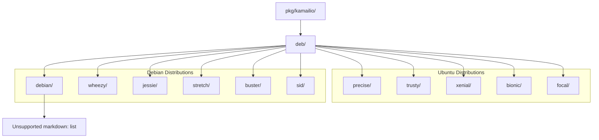
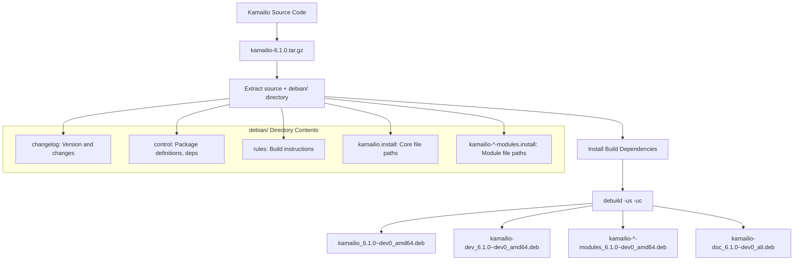
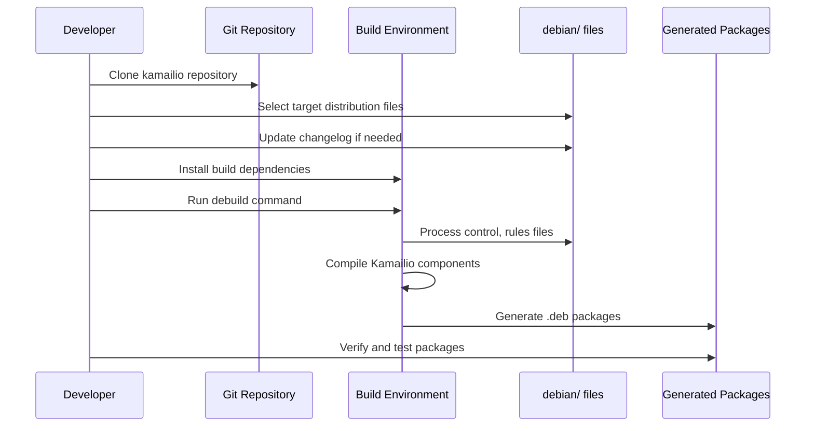

# Debian Packaging

> **Relevant source files**
> * [pkg/kamailio/deb/bionic/changelog](https://github.com/kamailio/kamailio/blob/2b4e9f8b/pkg/kamailio/deb/bionic/changelog)
> * [pkg/kamailio/deb/buster/changelog](https://github.com/kamailio/kamailio/blob/2b4e9f8b/pkg/kamailio/deb/buster/changelog)
> * [pkg/kamailio/deb/debian/changelog](https://github.com/kamailio/kamailio/blob/2b4e9f8b/pkg/kamailio/deb/debian/changelog)
> * [pkg/kamailio/deb/focal/changelog](https://github.com/kamailio/kamailio/blob/2b4e9f8b/pkg/kamailio/deb/focal/changelog)
> * [pkg/kamailio/deb/jessie/changelog](https://github.com/kamailio/kamailio/blob/2b4e9f8b/pkg/kamailio/deb/jessie/changelog)
> * [pkg/kamailio/deb/precise/changelog](https://github.com/kamailio/kamailio/blob/2b4e9f8b/pkg/kamailio/deb/precise/changelog)
> * [pkg/kamailio/deb/sid/changelog](https://github.com/kamailio/kamailio/blob/2b4e9f8b/pkg/kamailio/deb/sid/changelog)
> * [pkg/kamailio/deb/stretch/changelog](https://github.com/kamailio/kamailio/blob/2b4e9f8b/pkg/kamailio/deb/stretch/changelog)
> * [pkg/kamailio/deb/trusty/changelog](https://github.com/kamailio/kamailio/blob/2b4e9f8b/pkg/kamailio/deb/trusty/changelog)
> * [pkg/kamailio/deb/wheezy/changelog](https://github.com/kamailio/kamailio/blob/2b4e9f8b/pkg/kamailio/deb/wheezy/changelog)
> * [pkg/kamailio/deb/xenial/changelog](https://github.com/kamailio/kamailio/blob/2b4e9f8b/pkg/kamailio/deb/xenial/changelog)

## Purpose and Scope

This document outlines the Debian packaging system used for building and distributing Kamailio SIP server packages for Debian and Ubuntu distributions. It covers the packaging directory structure, configuration files, build process, and distribution-specific adjustments. For information about RPM-based distributions, see [RPM Packaging](/kamailio/kamailio/6.2-rpm-packaging).

## Directory Structure

The Debian packaging system in Kamailio is organized within the `pkg/kamailio/deb/` directory. Each supported Debian and Ubuntu distribution has its own subdirectory containing specific packaging configurations.



Sources: pkg/kamailio/deb/precise/changelog, pkg/kamailio/deb/wheezy/changelog, pkg/kamailio/deb/debian/changelog, pkg/kamailio/deb/jessie/changelog, pkg/kamailio/deb/trusty/changelog, pkg/kamailio/deb/stretch/changelog, pkg/kamailio/deb/sid/changelog, pkg/kamailio/deb/xenial/changelog, pkg/kamailio/deb/buster/changelog, pkg/kamailio/deb/bionic/changelog, pkg/kamailio/deb/focal/changelog

## Distribution Versioning

The Kamailio Debian packaging system maintains separate changelog files for each supported distribution, all tracking the same version but with distribution-specific adjustments.

Here's a summary of the distribution codenames and their corresponding Kamailio versions based on the changelog files:

| Distribution | Codename | Current Version |
| --- | --- | --- |
| Debian | debian | 6.1.0~dev0 |
| Debian | wheezy | 6.1.0~dev0 |
| Debian | jessie | 6.1.0~dev0 |
| Debian | stretch | 6.1.0~dev0 |
| Debian | buster | 6.1.0~dev0 |
| Debian | sid | 6.1.0~dev0 |
| Ubuntu | precise | 6.1.0~dev0 |
| Ubuntu | trusty | 6.1.0~dev0 |
| Ubuntu | xenial | 6.1.0~dev0 |
| Ubuntu | bionic | 6.1.0~dev0 |
| Ubuntu | focal | 6.1.0~dev0 |

All changelog files show the same format:

```
kamailio (6.1.0~dev0) unstable; urgency=medium

  * version set 6.1.0~dev0

 -- Victor Seva <vseva@debian.org>  Thu, 23 Jan 2025 08:51:36 +0100
```

This indicates a development version leading toward the 6.1.0 release, maintained by Victor Seva.

Sources: pkg/kamailio/deb/precise/changelog, pkg/kamailio/deb/wheezy/changelog, pkg/kamailio/deb/debian/changelog, pkg/kamailio/deb/jessie/changelog, pkg/kamailio/deb/trusty/changelog, pkg/kamailio/deb/stretch/changelog, pkg/kamailio/deb/sid/changelog, pkg/kamailio/deb/xenial/changelog, pkg/kamailio/deb/buster/changelog, pkg/kamailio/deb/bionic/changelog, pkg/kamailio/deb/focal/changelog

## Packaging Workflow

The Debian packaging process in Kamailio follows the standard Debian packaging workflow with distribution-specific adjustments.



Sources: pkg/kamailio/deb/debian/changelog

## Package Structure

The Kamailio packaging system creates multiple Debian packages to organize functionality into discrete components. This modular approach allows users to install only the specific features they need.

```mermaid
flowchart TD

kamailioCore["kamailio: Core SIP server"]
kamailioDev["kamailio-dev: Development headers"]
kamailioDoc["kamailio-doc: Documentation"]
mysqlMod["kamailio-mysql-modules: MySQL/MariaDB"]
postgreMod["kamailio-postgresql-modules: PostgreSQL"]
mongoMod["kamailio-mongodb-modules: MongoDB"]
redisMod["kamailio-redis-modules: Redis"]
unixodbcMod["kamailio-unixodbc-modules: ODBC"]
berkeleydMod["kamailio-berkeley-modules: BerkeleyDB"]
ldapMod["kamailio-ldap-modules: LDAP"]
tlsMod["kamailio-tls-modules: TLS support"]
websocketMod["kamailio-websocket-modules: WebSockets"]
sctpMod["kamailio-sctp-modules: SCTP support"]
outboundMod["kamailio-outbound-modules: SIP Outbound"]
jsonMod["kamailio-json-modules: JSON support"]
luaMod["kamailio-lua-modules: Lua scripting"]
pythonMod["kamailio-python-modules: Python scripting"]
kazooMod["kamailio-kazoo-modules: Kazoo integration"]
radiusMod["kamailio-radius-modules: RADIUS"]
xmlMod["kamailio-xml-modules: XML tools"]
cplMod["kamailio-cpl-modules: CPL support"]
snmpMod["kamailio-snmpstats-modules: SNMP"]

kamailioCore --> kamailioDev
kamailioCore --> kamailioDoc
kamailioCore --> mysqlMod
kamailioCore --> postgreMod
kamailioCore --> redisMod
kamailioCore --> mongoMod
kamailioCore --> unixodbcMod
kamailioCore --> berkeleydMod
kamailioCore --> ldapMod
kamailioCore --> tlsMod
kamailioCore --> websocketMod
kamailioCore --> sctpMod
kamailioCore --> outboundMod
kamailioCore --> jsonMod
kamailioCore --> luaMod
kamailioCore --> pythonMod
kamailioCore --> kazooMod
kamailioCore --> radiusMod
kamailioCore --> xmlMod
kamailioCore --> cplMod
kamailioCore --> snmpMod

subgraph subGraph2 ["Integration Modules"]
    jsonMod
    luaMod
    pythonMod
    kazooMod
    radiusMod
    xmlMod
    cplMod
    snmpMod
end

subgraph subGraph1 ["Protocol Modules"]
    tlsMod
    websocketMod
    sctpMod
    outboundMod
end

subgraph subGraph0 ["Storage Modules"]
    mysqlMod
    postgreMod
    mongoMod
    redisMod
    unixodbcMod
    berkeleydMod
    ldapMod
end
```



Sources: pkg/kamailio/deb/debian/changelog

## Building Debian Packages

To build Kamailio Debian packages, follow these steps:

1. Set up a Debian/Ubuntu build environment matching your target distribution.
2. Install build dependencies: ``` sudo apt-get install build-essential devscripts debhelper sudo apt-get build-dep kamailio ```
3. Clone the Kamailio repository: ``` git clone https://github.com/kamailio/kamailio.git cd kamailio ```
4. Choose your target distribution and copy its Debian packaging files: ``` cp -r pkg/kamailio/deb/<distribution> debian ``` Where `<distribution>` is the target distribution codename (e.g., buster, focal).
5. Build the packages: ``` debuild -us -uc ``` The resulting .deb files will be created in the parent directory.

## Cross-Distribution Considerations

When building packages for different Debian/Ubuntu distributions, consider these factors:

1. Library dependencies may have different versions across distributions
2. Build environments may have different compilers and build tools
3. Default configurations may need adjustment for distribution-specific paths
4. Feature support may vary based on available libraries in each distribution

Each distribution directory in `pkg/kamailio/deb/` contains customizations to address these differences.



Sources: pkg/kamailio/deb/debian/changelog

## Version Naming Convention

Kamailio follows Debian version naming conventions:

| Version String | Meaning |
| --- | --- |
| 6.1.0~dev0 | Development version leading to 6.1.0 |
| 6.1.0-1 | First packaging of 6.1.0 release |
| 6.1.0-2 | Second packaging revision (bug fixes) |
| 6.1.0+1 | Feature release after 6.1.0 |
| 6.1.0+dfsg1 | Version with non-free content removed |

The `~` symbol indicates a pre-release version that sorts before the final release, while `+` indicates a post-release modification.

Sources: pkg/kamailio/deb/debian/changelog, pkg/kamailio/deb/focal/changelog

## Conclusion

The Kamailio Debian packaging system provides a structured approach to building Debian packages for multiple distributions. The modular package organization allows for flexible installation options, with different modules installable as needed. The distribution-specific directories ensure compatibility across a wide range of Debian and Ubuntu versions.

For specific packaging issues or enhancements, consult the packaging maintainer indicated in the changelog files.