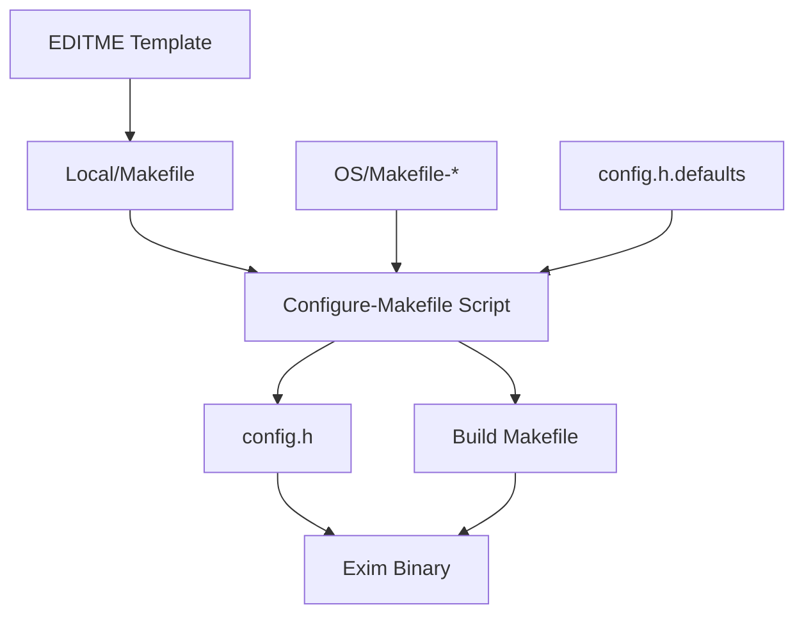
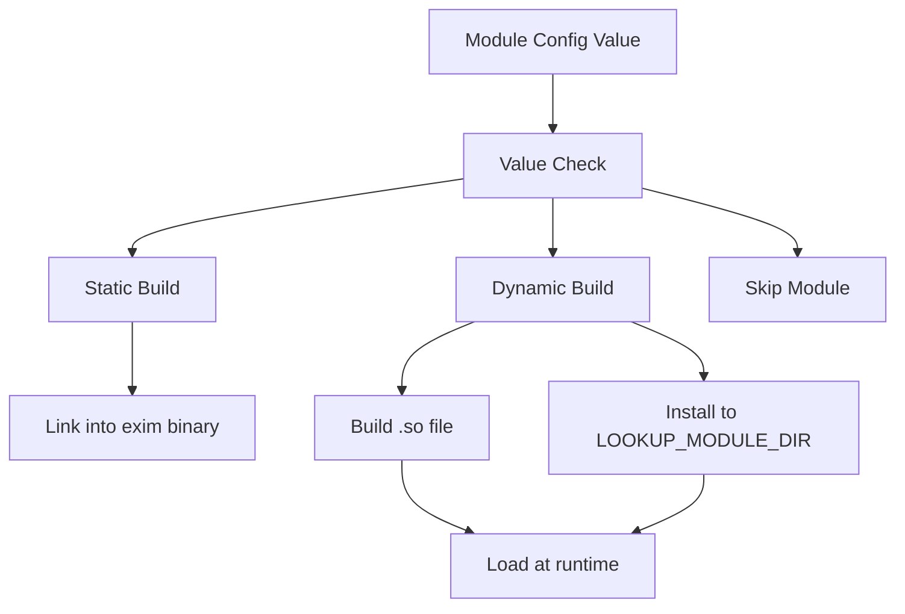
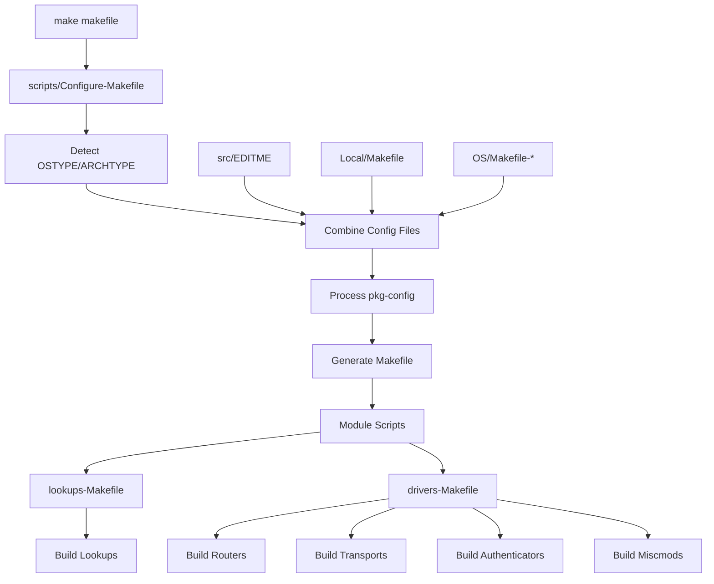
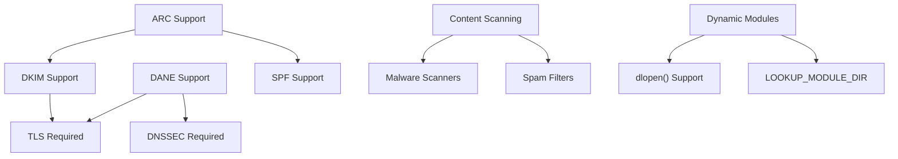
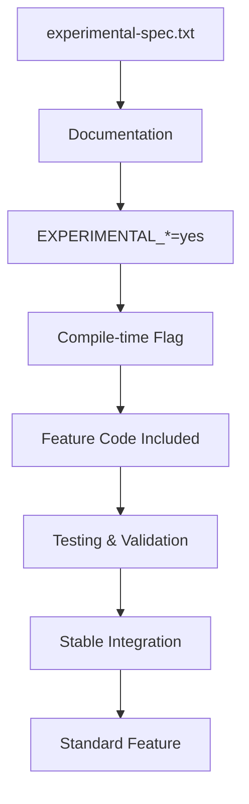
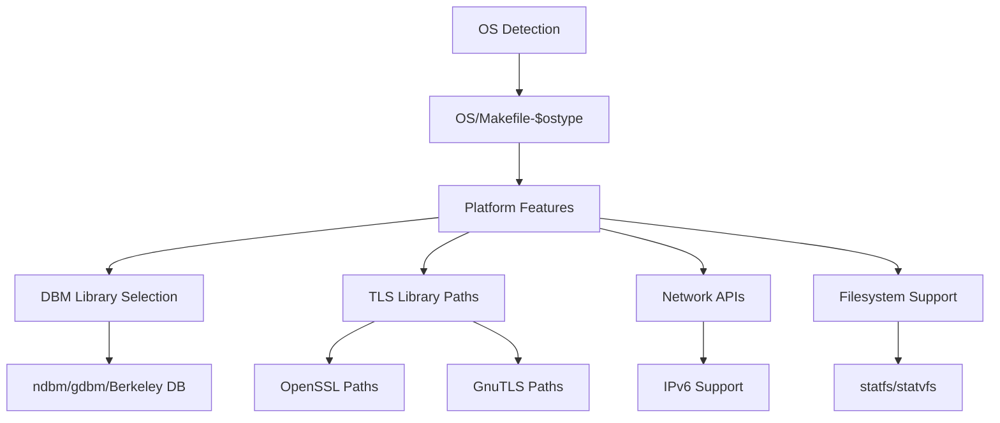

# Build-time Configuration

> **Relevant source files**
> * [doc/doc-txt/experimental-spec.txt](https://github.com/Exim/exim/blob/29568b25/doc/doc-txt/experimental-spec.txt)
> * [src/OS/Makefile-Base](https://github.com/Exim/exim/blob/29568b25/src/OS/Makefile-Base)
> * [src/scripts/Configure-Makefile](https://github.com/Exim/exim/blob/29568b25/src/scripts/Configure-Makefile)
> * [src/scripts/MakeLinks](https://github.com/Exim/exim/blob/29568b25/src/scripts/MakeLinks)
> * [src/scripts/lookups-Makefile](https://github.com/Exim/exim/blob/29568b25/src/scripts/lookups-Makefile)
> * [src/src/EDITME](https://github.com/Exim/exim/blob/29568b25/src/src/EDITME)
> * [src/src/auths/Makefile](https://github.com/Exim/exim/blob/29568b25/src/src/auths/Makefile)
> * [src/src/config.h.defaults](https://github.com/Exim/exim/blob/29568b25/src/src/config.h.defaults)
> * [src/src/drtables.c](https://github.com/Exim/exim/blob/29568b25/src/src/drtables.c)
> * [src/src/exim.h](https://github.com/Exim/exim/blob/29568b25/src/src/exim.h)
> * [src/src/lookups/Makefile](https://github.com/Exim/exim/blob/29568b25/src/src/lookups/Makefile)
> * [src/src/miscmods/Makefile](https://github.com/Exim/exim/blob/29568b25/src/src/miscmods/Makefile)
> * [src/src/routers/Makefile](https://github.com/Exim/exim/blob/29568b25/src/src/routers/Makefile)
> * [src/src/transports/Makefile](https://github.com/Exim/exim/blob/29568b25/src/src/transports/Makefile)

This document covers Exim's build-time configuration system, which determines which features, modules, and drivers are compiled into the Exim binary. This includes the template-based configuration system, module selection mechanisms, and the build process that transforms configuration choices into compiled code.

For runtime configuration of Exim's behavior, see [Runtime Configuration](/Exim/exim/4.2-runtime-configuration). For experimental features that may be enabled at build time, see [Experimental Features](/Exim/exim/4.3-experimental-features).

## Configuration Template System

Exim uses a template-based approach for build-time configuration. The primary template is `EDITME`, which administrators copy to `Local/Makefile` and customize for their specific requirements.

### Core Configuration Files

The build configuration system consists of several key files:

* **EDITME Template**: [src/src/EDITME L1-L1200](https://github.com/Exim/exim/blob/29568b25/src/src/EDITME#L1-L1200)  - The main configuration template containing all available build options
* **Default Values**: [src/src/config.h.defaults L1-L250](https://github.com/Exim/exim/blob/29568b25/src/src/config.h.defaults#L1-L250)  - Default macro definitions for all configurable features
* **OS-Specific Makefiles**: Located in `OS/Makefile-*` files for platform-specific settings
* **Generated Config**: `config.h` created during build process with final macro definitions

### Required Configuration Parameters

Four essential parameters must be specified in `Local/Makefile`:

| Parameter | Purpose | Example |
| --- | --- | --- |
| `BIN_DIRECTORY` | Installation path for Exim binaries | `/usr/exim/bin` |
| `CONFIGURE_FILE` | Runtime configuration file location | `/usr/exim/configure` |
| `EXIM_USER` | User account for Exim processes | `exim` or `ref:exim` |
| `SPOOL_DIRECTORY` | Mail spool directory | `/var/spool/exim` |

**Configuration Template Structure**



Sources: [src/src/EDITME L1-L100](https://github.com/Exim/exim/blob/29568b25/src/src/EDITME#L1-L100)

 [src/src/config.h.defaults L1-L50](https://github.com/Exim/exim/blob/29568b25/src/src/config.h.defaults#L1-L50)

 [src/scripts/Configure-Makefile L1-L50](https://github.com/Exim/exim/blob/29568b25/src/scripts/Configure-Makefile#L1-L50)

## Module Selection and Building

Exim's modular architecture allows selective inclusion of routers, transports, authenticators, lookups, and miscellaneous modules. Each module type can be built either statically (linked into the main binary) or dynamically (loaded at runtime).

### Module Types and Selection

The build system recognizes five main module categories:

**Router Modules**: [src/src/EDITME L325-L335](https://github.com/Exim/exim/blob/29568b25/src/src/EDITME#L325-L335)

```
ROUTER_ACCEPT=yes
ROUTER_DNSLOOKUP=yes  
ROUTER_MANUALROUTE=yes
ROUTER_REDIRECT=yes
```

**Transport Modules**: [src/src/EDITME L356-L365](https://github.com/Exim/exim/blob/29568b25/src/src/EDITME#L356-L365)

```
TRANSPORT_APPENDFILE=yes
TRANSPORT_SMTP=yes
TRANSPORT_PIPE=yes
TRANSPORT_AUTOREPLY=yes
```

**Lookup Methods**: [src/src/EDITME L432-L453](https://github.com/Exim/exim/blob/29568b25/src/src/EDITME#L432-L453)

```
LOOKUP_DBM=yes
LOOKUP_LSEARCH=yes
LOOKUP_MYSQL=yes
LOOKUP_LDAP=yes
```

### Static vs Dynamic Module Building

Modules can be built in two modes controlled by their configuration values:

* **Static Building** (`=yes` or `=1`): Module code linked directly into `exim` binary
* **Dynamic Building** (`=2`): Module compiled as separate `.so` file loaded at runtime

**Dynamic Module Configuration Requirements**: [src/src/EDITME L394-L398](https://github.com/Exim/exim/blob/29568b25/src/src/EDITME#L394-L398)

```
LOOKUP_MODULE_DIR=/usr/lib/exim/lookups/
CFLAGS_DYNAMIC=-shared -rdynamic -fPIC  
EXTRALIBS += -export-dynamic -rdynamic -ldl
```

**Module Build Decision Flow**



Sources: [src/src/EDITME L317-L400](https://github.com/Exim/exim/blob/29568b25/src/src/EDITME#L317-L400)

 [src/src/drtables.c L228-L270](https://github.com/Exim/exim/blob/29568b25/src/src/drtables.c#L228-L270)

## Build Process Flow

The build system transforms configuration templates into compiled modules through a multi-stage process coordinated by shell scripts and generated Makefiles.

### Configuration Processing Pipeline

**Build Configuration Flow**



### Script Coordination

Key scripts orchestrate the build process:

**Configure-Makefile**: [src/scripts/Configure-Makefile L84-L134](https://github.com/Exim/exim/blob/29568b25/src/scripts/Configure-Makefile#L84-L134)

 - Main configuration processor

* Combines multiple Makefile fragments
* Processes `pkg-config` dependencies
* Handles OS-specific settings
* Generates final build Makefiles

**lookups-Makefile**: [src/scripts/lookups-Makefile L92-L157](https://github.com/Exim/exim/blob/29568b25/src/scripts/lookups-Makefile#L92-L157)

 - Lookup module builder

* Determines static vs dynamic building for each lookup
* Generates module build rules
* Handles `pkg-config` integration for lookup dependencies

### Makefile Generation Process

The build system creates specialized Makefiles for each module category:

| Makefile | Purpose | Generated From |
| --- | --- | --- |
| `lookups/Makefile` | Lookup modules | [src/src/lookups/Makefile L1-L51](https://github.com/Exim/exim/blob/29568b25/src/src/lookups/Makefile#L1-L51) |
| `routers/Makefile` | Router drivers | [src/src/routers/Makefile L1-L43](https://github.com/Exim/exim/blob/29568b25/src/src/routers/Makefile#L1-L43) |
| `transports/Makefile` | Transport drivers | [src/src/transports/Makefile L1-L54](https://github.com/Exim/exim/blob/29568b25/src/src/transports/Makefile#L1-L54) |
| `auths/Makefile` | Authentication modules | [src/src/auths/Makefile L1-L55](https://github.com/Exim/exim/blob/29568b25/src/src/auths/Makefile#L1-L55) |
| `miscmods/Makefile` | Miscellaneous modules | [src/src/miscmods/Makefile L1-L81](https://github.com/Exim/exim/blob/29568b25/src/src/miscmods/Makefile#L1-L81) |

**Module Build Rules Generation**: [src/scripts/lookups-Makefile L122-L157](https://github.com/Exim/exim/blob/29568b25/src/scripts/lookups-Makefile#L122-L157)

```
emit_module_rule() {
  if want_dynamic "$lookup_name"; then
    MODS="${MODS} ${mod_name}.so"
  elif want_at_all "$lookup_name"; then  
    OBJ="${OBJ} ${mod_name}.o"
  fi
}
```

Sources: [src/scripts/Configure-Makefile L75-L290](https://github.com/Exim/exim/blob/29568b25/src/scripts/Configure-Makefile#L75-L290)

 [src/scripts/lookups-Makefile L92-L190](https://github.com/Exim/exim/blob/29568b25/src/scripts/lookups-Makefile#L92-L190)

 [src/OS/Makefile-Base L39-L45](https://github.com/Exim/exim/blob/29568b25/src/OS/Makefile-Base#L39-L45)

## Feature Selection System

Exim's build system provides fine-grained control over feature inclusion through preprocessor macros and conditional compilation.

### Core Feature Categories

**TLS Support**: [src/src/EDITME L187-L285](https://github.com/Exim/exim/blob/29568b25/src/src/EDITME#L187-L285)

```markdown
USE_OPENSSL=yes          # OpenSSL backend
USE_GNUTLS=yes           # GnuTLS backend  
DISABLE_TLS=yes          # No TLS support
```

**Content Scanning**: [src/src/EDITME L579-L605](https://github.com/Exim/exim/blob/29568b25/src/src/EDITME#L579-L605)

```markdown
WITH_CONTENT_SCAN=yes    # Enable malware/spam scanning
DISABLE_MAL_CLAM=yes     # Disable specific scanner
DISABLE_MAL_AVAST=yes    # Disable specific scanner
```

**Authentication Methods**: [src/src/config.h.defaults L24-L34](https://github.com/Exim/exim/blob/29568b25/src/src/config.h.defaults#L24-L34)

```
#define AUTH_CRAM_MD5
#define AUTH_PLAINTEXT  
#define AUTH_SPA
#define AUTH_TLS
```

### Feature Dependency Resolution

The build system automatically resolves feature dependencies and validates configurations:

**Feature Dependency Matrix**



**Macro Processing**: [src/src/drtables.c L32-L100](https://github.com/Exim/exim/blob/29568b25/src/src/drtables.c#L32-L100)

 - Runtime feature detection

```python
#ifndef MACRO_PREDEF
gstring * auth_show_supported(gstring * g) {
  uschar * b = US""
#if defined(AUTH_CRAM_MD5) && AUTH_CRAM_MD5!=2
    " cram_md5"
#endif
  // ... additional authenticators
}
#endif
```

Sources: [src/src/EDITME L187-L300](https://github.com/Exim/exim/blob/29568b25/src/src/EDITME#L187-L300)

 [src/src/config.h.defaults L20-L230](https://github.com/Exim/exim/blob/29568b25/src/src/config.h.defaults#L20-L230)

 [src/src/drtables.c L34-L100](https://github.com/Exim/exim/blob/29568b25/src/src/drtables.c#L34-L100)

## Experimental Features Integration

Experimental features follow a controlled integration path from optional compilation flags to stable feature inclusion.

### Experimental Feature Lifecycle

**Experimental Configuration**: [doc/doc-txt/experimental-spec.txt L1-L50](https://github.com/Exim/exim/blob/29568b25/doc/doc-txt/experimental-spec.txt#L1-L50)

```markdown
EXPERIMENTAL_ARC=yes           # ARC authentication chains
EXPERIMENTAL_DCC=yes           # DCC spam checking  
EXPERIMENTAL_QUEUEFILE=yes     # Queue file transport
EXPERIMENTAL_XCLIENT=yes       # XCLIENT proxy support
```

**Feature Activation Process**



### Experimental Feature Implementation

Features marked as experimental require explicit build-time activation and often have specific dependency requirements:

**ARC Support**: [doc/doc-txt/experimental-spec.txt L495-L500](https://github.com/Exim/exim/blob/29568b25/doc/doc-txt/experimental-spec.txt#L495-L500)

```markdown
EXPERIMENTAL_ARC=yes
# Requires DKIM and SPF support
# Can be built as dynamic module with SUPPORT_ARC=2
```

**Build Integration**: [src/src/config.h.defaults L218-L227](https://github.com/Exim/exim/blob/29568b25/src/src/config.h.defaults#L218-L227)

```
/* EXPERIMENTAL features */
#define EXPERIMENTAL_ARC
#define EXPERIMENTAL_BRIGHTMAIL  
#define EXPERIMENTAL_DCC
#define EXPERIMENTAL_QUEUEFILE
```

**Runtime Detection**: [src/src/drtables.c L743-L760](https://github.com/Exim/exim/blob/29568b25/src/src/drtables.c#L743-L760)

 - Experimental feature tables

```
#if !defined(DISABLE_DKIM) && (!defined(SUPPORT_DKIM) || SUPPORT_DKIM!=2)
extern misc_module_info dkim_module_info;
#endif
```

Sources: [doc/doc-txt/experimental-spec.txt L1-L100](https://github.com/Exim/exim/blob/29568b25/doc/doc-txt/experimental-spec.txt#L1-L100)

 [src/src/config.h.defaults L218-L230](https://github.com/Exim/exim/blob/29568b25/src/src/config.h.defaults#L218-L230)

 [src/src/drtables.c L743-L770](https://github.com/Exim/exim/blob/29568b25/src/src/drtables.c#L743-L770)

## Platform Adaptation

The build system accommodates different operating systems and architectures through OS-specific configuration files and detection scripts.

### Operating System Detection

**Platform Detection**: [src/scripts/Configure-Makefile L15-L31](https://github.com/Exim/exim/blob/29568b25/src/scripts/Configure-Makefile#L15-L31)

```php
ostype=`../scripts/os-type -generic` || exit 1
archtype=`../scripts/arch-type` || exit 1

if [ ! -r ../OS/Makefile-$ostype ] ; then
  echo "*** Sorry - operating system $ostype is not supported"
  exit 1
fi
```

**OS-Specific Makefile Processing**: [src/scripts/Configure-Makefile L118-L134](https://github.com/Exim/exim/blob/29568b25/src/scripts/Configure-Makefile#L118-L134)

```
for f in OS/Makefile-Default \
         OS/Makefile-$ostype \
         Local/Makefile \
         Local/Makefile-$ostype \
         Local/Makefile-$archtype \
         Local/Makefile-$ostype-$archtype
```

### Platform-Specific Build Adaptations

The build system handles platform differences through several mechanisms:

**Compiler and Tool Variations**: [src/OS/Makefile-Base L18-L36](https://github.com/Exim/exim/blob/29568b25/src/OS/Makefile-Base#L18-L36)

```markdown
LNCC = $(CC)                    # Linker command override
SHELL = $(MAKE_SHELL)           # Shell selection  
FULLECHO = @                    # Output verbosity control
```

**OS-Specific Feature Support**



**Dynamic Library Support**: [src/src/exim.h L63-L67](https://github.com/Exim/exim/blob/29568b25/src/src/exim.h#L63-L67)

```python
/* If not overridden by os.h, dynamic libraries have filenames ending .so */
#ifndef DYNLIB_FN_EXT
# define DYNLIB_FN_EXT "so"
#endif
```

Sources: [src/scripts/Configure-Makefile L15-L50](https://github.com/Exim/exim/blob/29568b25/src/scripts/Configure-Makefile#L15-L50)

 [src/OS/Makefile-Base L11-L50](https://github.com/Exim/exim/blob/29568b25/src/OS/Makefile-Base#L11-L50)

 [src/src/exim.h L63-L67](https://github.com/Exim/exim/blob/29568b25/src/src/exim.h#L63-L67)